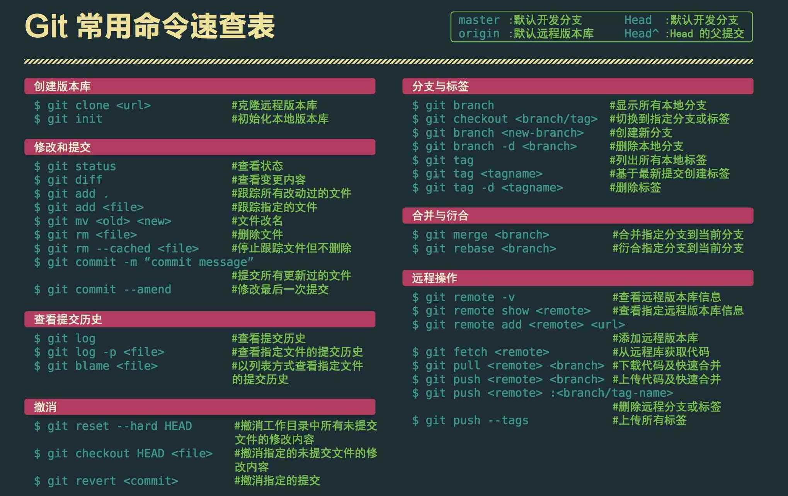

# 我的Git学习笔记

廖雪峰老师说得好：[Git](https://git-scm.com/)是一个工具，就没必要把时间浪费在那些“高级”但几乎永远不会用到的命令上。  
对于编写程序而言，实践是最好的老师，因此将[廖老师Git教程](https://www.liaoxuefeng.com/wiki/0013739516305929606dd18361248578c67b8067c8c017b000)学习过程记录于此，不时复习！

## 目录
> + [1.Git安装与版本库创建](./res/post/1.Set_up_Git_and_Creat_repository.md)
> 
> + [2.时空机穿梭](./res/post/2.Time_Machine.md)
> 
> + [3.远程仓库](./res/post/3.Remote_repository.md)
> 
> + [4.分支管理](./res/post/4.Branch_management.md)
> 
> + [5.实操情景：Bug和feature分支](./res/post/5.Bug_feature_Branch.md)
> 
> + [6.多人协作](./res/post/6.Cooperation.md)
> 
> + [7.标签管理](./res/post/7.tag_management.md)
> 
> + [8.自定义Git](./res/post/8.design_git.md)

## 附：常用命令总结

### 分支操作
+ git branch 创建分支

+ git checkout -b 创建并切换到新建的分支上

+ git checkout 切换分支

+ git branch 查看分支列表

+ git branch -v 查看所有分支的最后一次操作

+ git branch -vv 查看当前分支

+ git brabch -b 分支名 origin/分支名 创建远程分支到本地

+ git branch --merged 查看别的分支和当前分支合并过的分支

+ git branch --no-merged 查看未与当前分支合并的分支

+ git branch -d 分支名 删除本地分支

+ git branch -D 分支名 强行删除分支

+ git branch origin :分支名 删除远处仓库分支

+ git merge 分支名 合并分支到当前分支上

### 暂存操作
+ git stash 暂存当前修改

+ git stash apply 恢复最近的一次暂存

+ git stash pop 恢复暂存并删除暂存记录

+ git stash list 查看暂存列表

+ git stash drop 暂存名(例：stash@{0}) 移除某次暂存

+ git stash clear 清除暂存

### 回退操作
+ git reset --hard HEAD^ 回退到上一个版本

+ git reset --hard ahdhs1(commit_id) 回退到某个版本

+ git checkout -- file
  撤销修改的文件(如果文件加入到了暂存区，则回退到暂存区的，如果文件加入到了版本库，则还原至加入版本库之后的状态)

+ git reset HEAD file 撤回暂存区的文件修改到工作区

### 标签操作
+ git tag 标签名 添加标签(默认对当前版本)

+ git tag 标签名 commit_id 对某一提交记录打标签

+ git tag -a 标签名 -m '描述' 创建新标签并增加备注

+ git tag 列出所有标签列表

+ git show 标签名 查看标签信息

+ git tag -d 标签名 删除本地标签

+ git push origin 标签名 推送标签到远程仓库

+ git push origin --tags 推送所有标签到远程仓库

+ git push origin :refs/tags/标签名 从远程仓库中删除标签

### 其它操作
#### 常规操作
+ git push origin test 推送本地分支到远程仓库

+ git rm -r --cached 文件/文件夹名字 取消文件被版本控制

+ git reflog 获取执行过的命令

+ git log --graph 查看分支合并图

+ git merge --no-ff -m '合并描述' 分支名 不使用Fast forward方式合并，采用这种方式合并可以看到合并记录

+ git check-ignore -v 文件名 查看忽略规则

+ git add -f 文件名 强制将文件提交

#### git创建项目仓库
1. git init 初始化

2. git remote add origin url 关联远程仓库
3. git pull
4. git fetch 获取远程仓库中所有的分支到本地

#### 忽略已加入到版本库中的文件
1. git update-index --assume-unchanged file 忽略单个文件

2. git rm -r --cached 文件/文件夹名字 (. 忽略全部文件)

#### 取消忽略文件
+ git update-index --no-assume-unchanged file

#### 拉取、上传免密码
+ git config --global credential.helper store